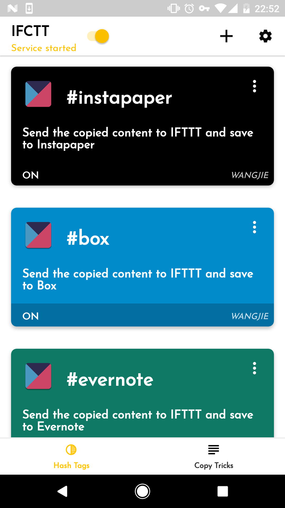
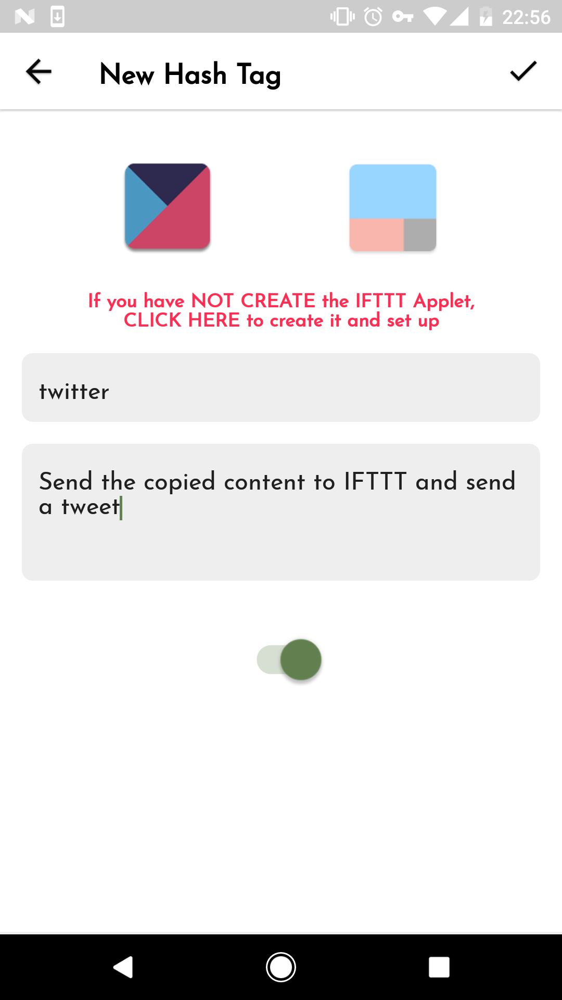
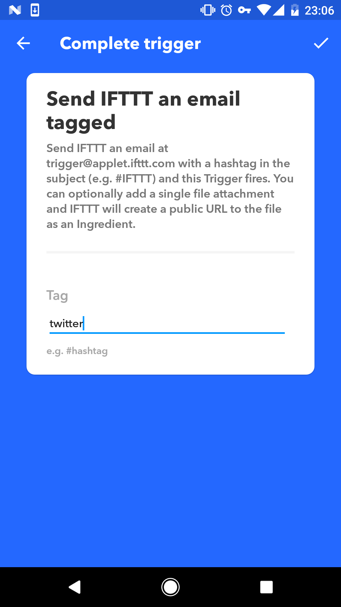
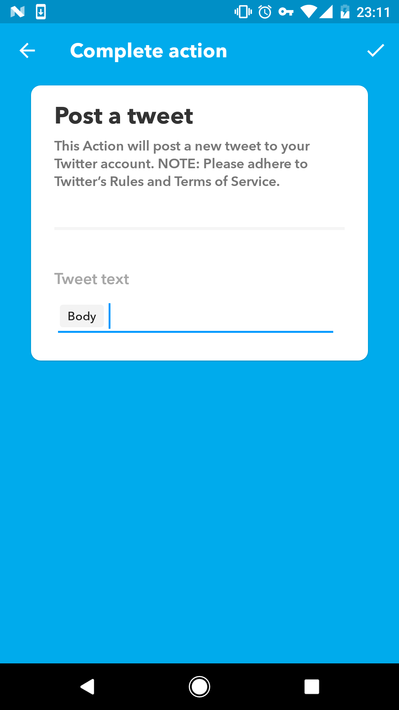

# Create customized hash tages

[中文版本](ifctt_create_custom_hash_tags_zh.html)

Except the preinstalled Hash tags provided by IFCTT, you could create your own Hash tags, now let us create a hash tags to realize below functions:

```
When you copy a passage and click this tag, it will send a tweet through IFTTT.
```



Click the `＋` button on the top right corner, add a Hash tag



<span id="tag_twitter"/>
As above, fill in the tag as `twitter`( or any other name at your will) and note (at your will), after these, you also have to create a relevant `IFTTT Applet` in IFTTT, click the words in red or the IFTTT icon to open the page of IFTTT’Applet, click the `＋` button at the top of below figure to create.


this（trigger）select `Email`, and select `Send IFTTT an email tagged`(must complete):



The tag of above figure must be typed `twitter` ([same as in IFCTT](#tag_twitter)),

`that`（action）select `Twitter`, and select `Post a tweet`, set as below:



The above `body` is what we copy from IFCTT

After submit successfully, return to the creating page of IFCTT to submit, the hash tag is created.


