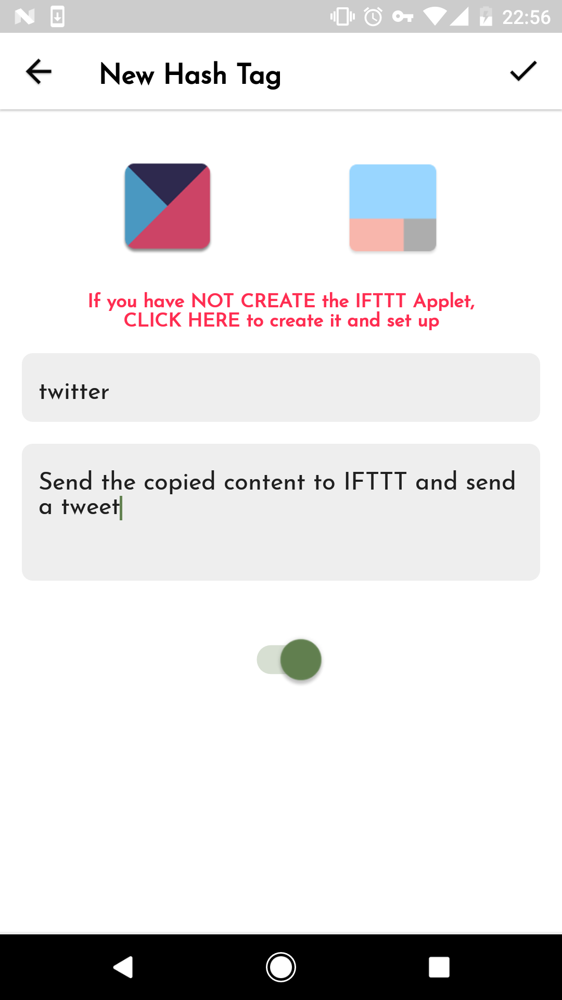

# 创建自定义的Hash tags

[English Version](ifctt_create_custom_hash_tags.html)

除了[使用IFCTT提供的默认Hash tags](../ifctt_use_default_hash_tags/ifctt_use_default_hash_tags.md)之外，你还可以创建自己的Hash tags，现在我们来创建一个Hash tags实现如下功能：

```
当你复制了一段文字后，点击此标签后，自动通过IFTTT在你的`Twitter`上发送一条推特
```


点击首页右上角的`+`按钮，添加一个Hash tag，



<span id="tag_twitter"/>
如上，填写`tag`为`twitter`（可以自己任意填写）和note（任意填写），除了填写以上信息，还需要在IFTTT中创建对应的`IFTTT Applet`，点击上图红色字或者IFTTT的图标，即会进入到IFTTT界面，点击下图顶部的`+`按钮来创建`IFTTT Applet`：


`this`（trigger）选择`Email`，并选择**`Send IFTTT an email tagged`**（必须）：


上图中的`Tag`输入为`twitter`（[必须要与IFCTT中的一致](#tag_twitter)！），

`that`（action）选择`Twitter`，并选择**`Post a tweet`**，然后设置如下：


上面中的`body`就是指的就是IFCTT中的复制内容

提交成功后，返回到IFCTT中的创建页面提交，这时Hash tag创建成功


