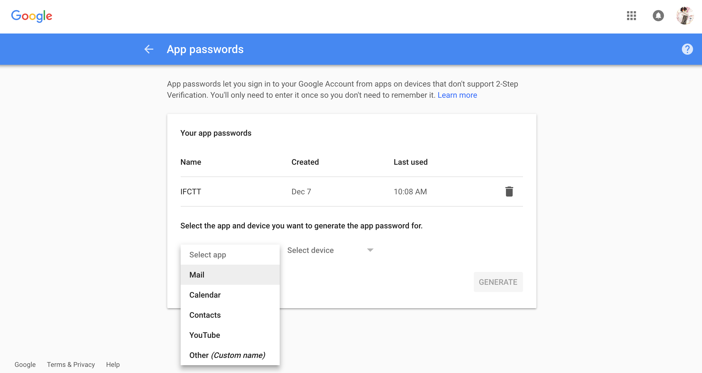
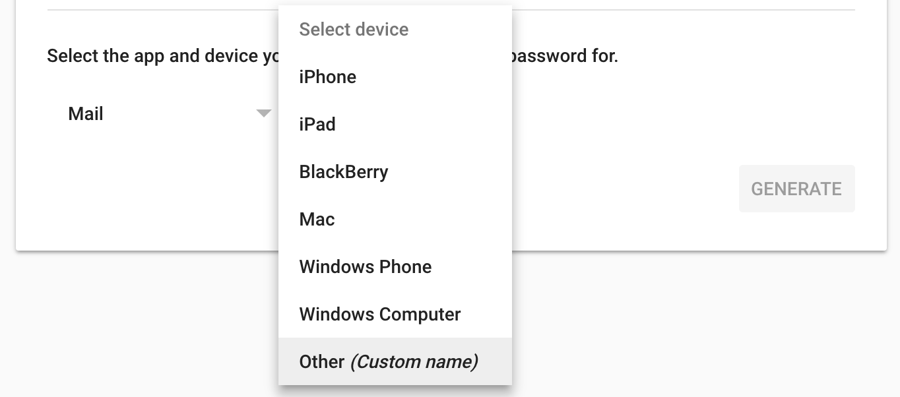
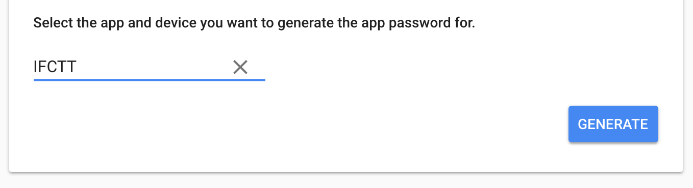
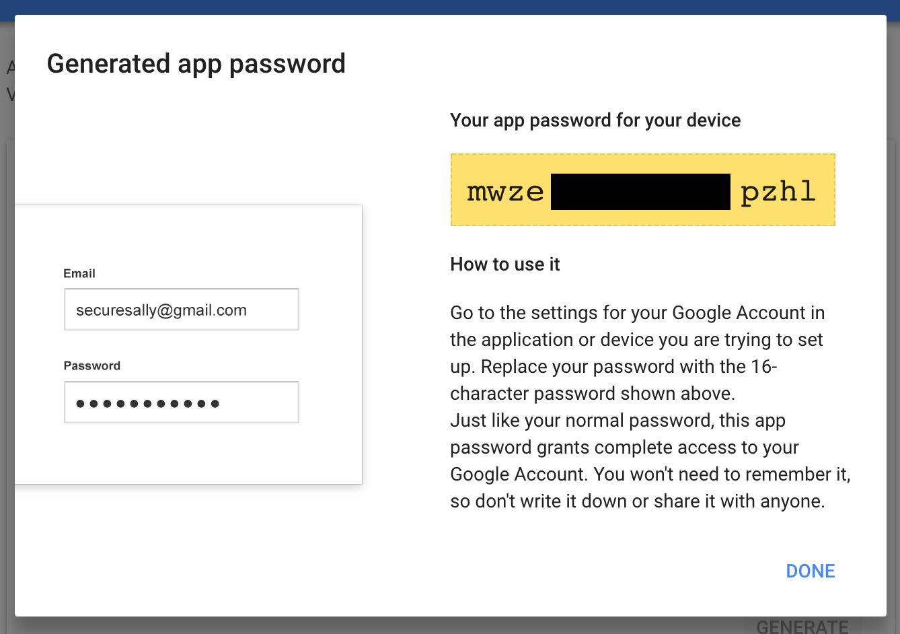
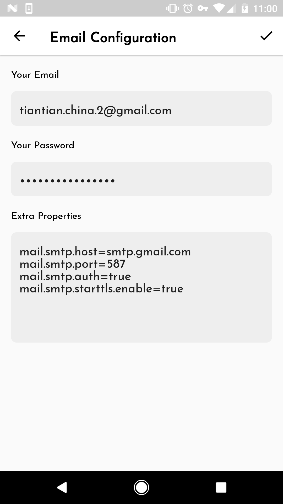

[toc]

[中文版本](ifctt_email_configuration_zh.html)

First, Download and install IFCTT App：

Google Play：

# IFCTT Email configuration

> **Configuration based on the email address used in IFCTT(recommend to use Gmail)**

## 1. Email configuration for Gmail

### 1.1 Creating app password

First you need to create IFCTT app password, click below link to login in Google:

<https://support.google.com/accounts/answer/185833>

Select app as `Mail`：

Select device as `Other (Custom name)`：

Type `IFCTT` into the input field:

Then, click `GENERATE`：

**Above 16 characters password in yellow area is our app password, select and copy.**

### 1.2  Email configuration for Gmail in IFCTT

Open IFCTT app，enter into`Settings` -> `Email Configuration` and fill in relevant information：

> **Notice**：
> 
> **password**：is the created app password in [1.1 Creating app password](#app_password)
> **Extra properties**：If you use Gmail address, do not modify the content, pls keep it original.

