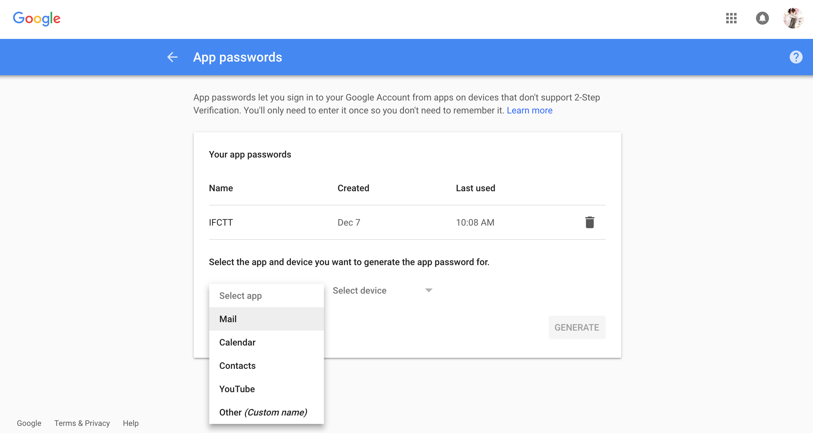
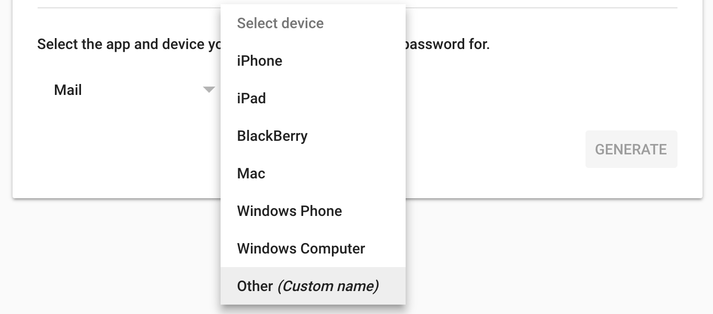
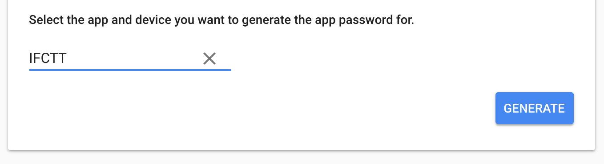
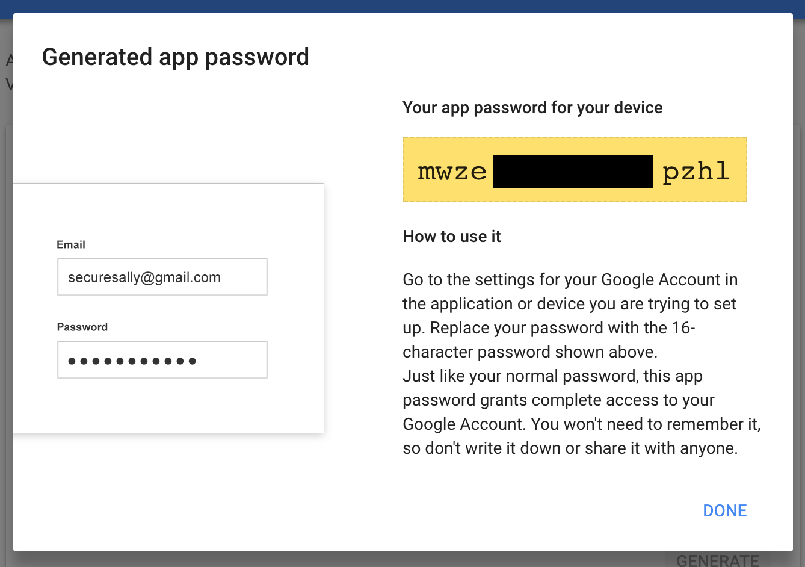

[toc]

[English Version](ifctt_create_custom_hash_tags.html)

首先，下载安装IFCTT App：

Google Play：<https://play.google.com/store/apps/details?id=com.wangjie.ifctt>

# IFCTT Email配置

> **根据你在IFTTT使用的邮箱来进行配置(推荐使用Gmail)**

## 1. Gmail邮箱配置

### 1.1 生成应用专用密码

首先需要为IFCTT生成一个App专用密码，打开以下链接并登陆Google账号：

<https://support.google.com/accounts/answer/185833>

选择app为`Mail`：

选择设备为`Other (Custom name)`：

然后在输入框中填入`IFCTT`：

然后，点击`GENERATE`：

**以上黄色区域中的16个字符的密码就是我们需要的专用密码，选中复制**

### 1.2 在IFCTT中配置Gmail

打开IFCTT，进入`Settings` -> `Email Configuration` 并填写相关信息：

> **注意**：
> 
> **password**：为[1.1 生成应用专用密码](#app_password)中生成的应用专用密码
> **Extra properties**：如果你使用的是Gmail邮箱，则内容不需要改动，保持最初始的状态即可

