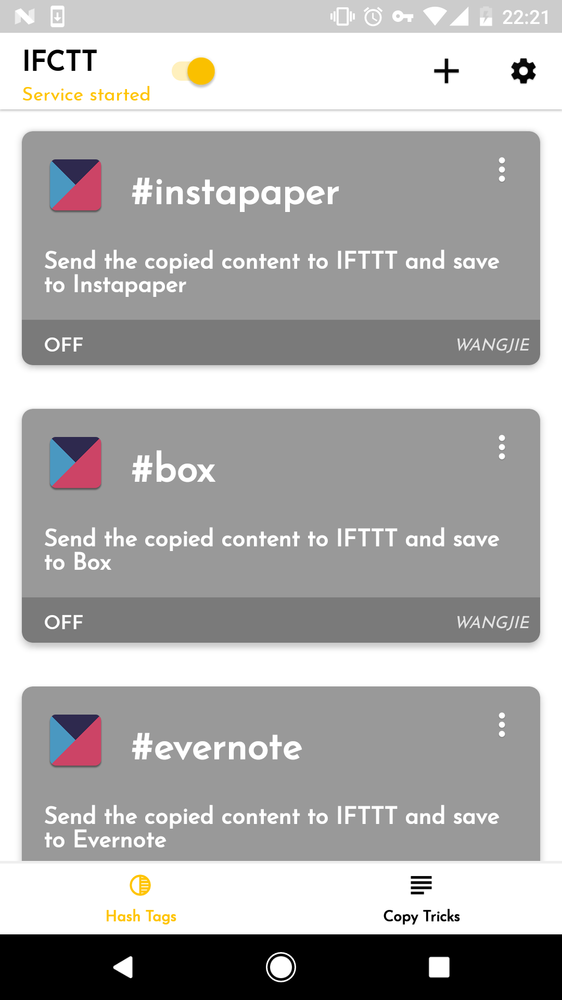
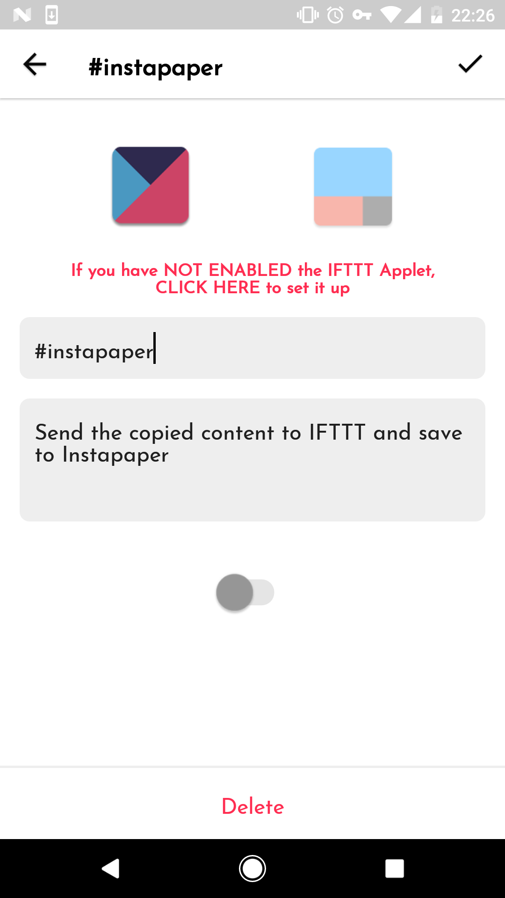
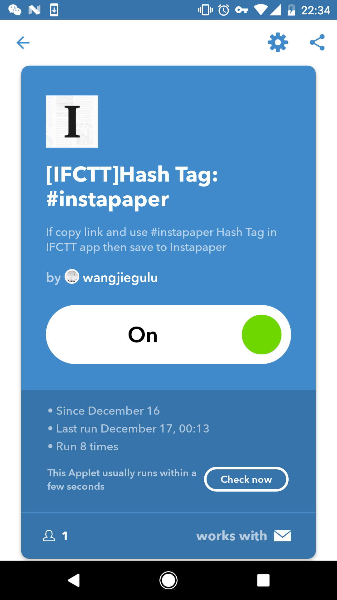

# How to use the preinstalled Hash tags of IFCTT?

[中文版本](use_default_hash_tags_zh.html)

After installing IFCTT, the app will automatically create 5 below preinstalled Hash tags the first time you login in:

- **\#instapaper**：with this tag when you copy content of article, it will recognize the copied content, if it is a link, it will push the link through IFTTT to your `instapaper`
- **\#box**：with this tag when you copy content of article, it will push the content through IFTTT to your `box`, and save to the file path named `IFTTT/Email/IFCTT`.
- **\#evernote**：with this tag when you copy content of article, it will push the content through IFTTT to your `evernote`, and save to the file path named `IFTTT/Email/IFCTT`.
- **\#pocket**：with this tag when you copy content of article, it will recognize the copied content, if it is a link, it will push the link through IFTTT to your `pocket`
- **\#googledoc**：with this tag when you copy content of article, it will push the content through IFTTT to your `google docs`, and save to the file path named `IFTTT/Email/IFCTT`.

The first time you enter in, the default of all hash tags are `OFF`, as shown in the following figure:

Below is an example to enable the hash tag of instapaper

Firstly, enter into the Edit page of `#instapaper`, as below figure:

As above figure, click the turn on bottom

Then as the `IFTTT Applet` of preinstalled Hash tags has already been created, you could directly enter the page of `IFTTT Applet` and turn on, as above figure, click the words in red or the IFTTT icon to open the below page of `IFTTT Applet`:

Click the turn on button, IFTTT may ask you to bind your instapaper’s account, pls bind as the normal process(if it is binded, you don’t have to bind twice), after operation completed, the instapaper applet of IFTTT will be enabled.

Finally return to the IFCTT’s Edit page of `#instapaper`, click the top right corner button to save, return to the home page after successfully saved, the card of instapaper will shown as colured.

The way to enable other preinstalled Hash tags are similar.

