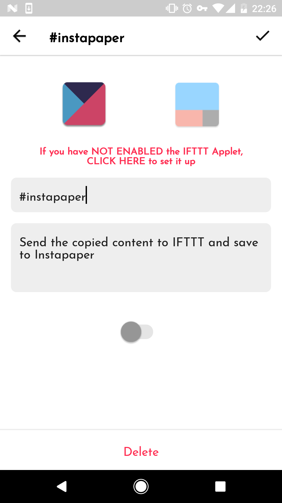
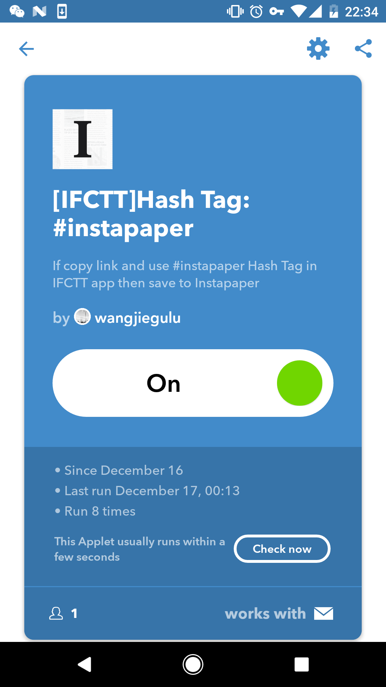

# 怎么使用IFCTT自带默认的Hash tags

[English version](use_default_hash_tags.html)

在安装完IFCTT之后，首次进入，app会自动帮你创建以下5个默认的Hash tags：

- **\#instapaper**：这个标签会使得当你复制了文本内容时，此标签会识别当前复制的内容，如果是链接，则通过IFTTT推送到你的`instapaper`
- **\#box**：这个标签会使得当你复制了文本内容时，此标签会通过IFTTT推送到你的box，把内容追加保存在box的路径为`IFTTT/Email/IFCTT`的文件中
- **\#evernote**：这个标签会使得当你复制了文本内容时，此标签会通过IFTTT推送到你的`evernote`，把内容追加保存在`evernote`的名为`IFTTT/Email/IFCTT`的文件中
- **\#pocket**：这个标签会使得当你复制了文本内容时，此标签会识别当前复制的内容，如果是链接，则通过IFTTT推送到你的`pocket`
- **\#googledoc**：这个标签会使得当你复制了文本内容时，此标签会通过IFTTT推送到你的`google docs`，把内容追加保存在`google docs`的名为`IFTTT/Email/IFCTT`的文件中

第一次进入后，所有的Hash tags都是默认`OFF`状态的，如下图所示：

下面以开启`instapaper`这个Hash tag为例

首先点击进入`#instapaper`的编辑页面，如下图：

首先如上图中，先点击开启按钮

然后因为默认的Hash tag所对应的`IFTTT Applet`都已经创建好了，所以可以直接进入IFTTT的Applet界面添加并开启，如上图，点击红色字体部分或者`IFTTT`的图标，将会打开如下`IFTTT`的Applet界面：

点击开启图标，这时IFTTT可能会让你绑定你的instapaper账号，按照流程正常绑定即可（如果以前已经绑定过了则不需要再次绑定），操作完毕后，IFTTT的instapaper applet就会开启。

最后返回到IFCTT `#instapaper`的编辑页面，点击右上角进行保存，成功后回到首页，instapaper的card将会变成彩色。

其他IFCTT自带默认的Hash tags开启方式都类似。

